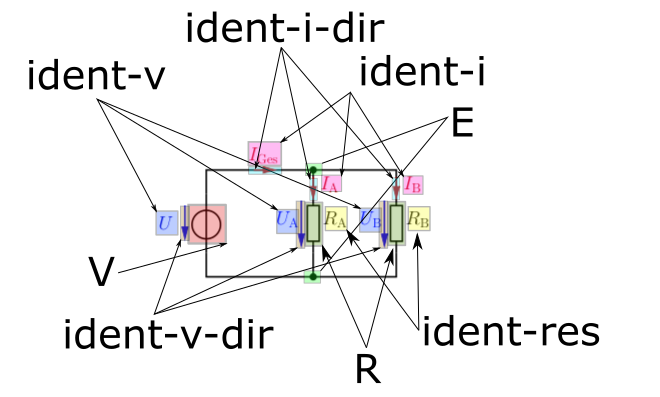

# AITEE Electrical Circuit Dataset

[](https://arxiv.org/abs/2505.21582)
[](LICENSE)

This repository contains the electrical circuit dataset used for training and evaluating the object detection components of the **AITEE (Agentic Tutor for Electrical Engineering)** system, as presented in our paper:

*Knievel, C., Bernhardt, A., & Bernhardt, C. (2025). AITEE - Agentic Tutor for Electrical Engineering. arXiv preprint arXiv:2505.21582.*

## 📋 Table of Contents

- [Citation](#citation)
- [Dataset Overview](#dataset-overview)
- [Labeled Elements](#labeled-elements)
- [Data Format](#data-format)
- [Directory Structure](#directory-structure)
- [Sample Images](#sample-images)
- [Usage](#usage)
- [License](#license)
- [Contact](#contact)

## 📖 Citation

If you use this dataset in your research, please cite our paper:

```bibtex
@misc{knievel2025aitee,
      title={AITEE - Agentic Tutor for Electrical Engineering},
      author={Christopher Knievel and Alexander Bernhardt and Christian Bernhardt},
      year={2025},
      eprint={2505.21582},
      archivePrefix={arXiv},
      primaryClass={cs.CY}
}
```

Additionally, you can cite the dataset directly:

```bibtex
@misc{aitee_dataset_2025,
    author    = {Knievel, Christopher and Bernhardt, Alexander and Bernhardt, Christian},
    title     = {AITEE Electrical Circuit Dataset},
    year      = {2025},
    publisher = {GitHub},
    journal   = {GitHub repository},
    howpublished = {\url{https://github.com/CKnievel/aitee-dataset}}
}
```

## 🔍 Dataset Overview

This dataset was created to train models for detecting components and connection points in electrical circuit diagrams, particularly those encountered by first-semester electrical engineering students. The circuits are primarily resistor-based and include various configurations commonly found in educational settings.

### Key Statistics
- **Number of Circuits**: 831
- **Image Format**: PNG (with one JPG file)
- **Annotation Format**: YOLO v8 compatible
- **Classes**: 11 different component and identifier types

### Circuit Types
The dataset includes various circuit configurations:

- **Linear (Series) circuits**
- **Parallel circuits** 
- **Mixed (Series-Parallel) circuits**
- **Voltage dividers**
- **Wheatstone bridges**
- **Delta (Δ) and Star (Y) circuits**

### Source
The circuits were drawn based on the syllabus of "Electrical Engineering 1" at HTWG Hochschule Konstanz, University of Applied Sciences, to reflect typical educational material. The style aims to be representative of hand-drawn or digitally sketched diagrams commonly found in textbooks and exercises.

## 🏷️ Labeled Elements

The dataset includes annotations for the following 11 classes:

### Components
| Class ID | Class Name | Description |
|----------|------------|-------------|
| 0 | `E` | Edge connections |
| 1 | `GND` | Ground symbols |
| 2 | `I` | Current sources |
| 3 | `P` | Connection points/junctions |
| 4 | `R` | Resistors |
| 5 | `V` | Voltage sources |

### Component Identifiers
| Class ID | Class Name | Description |
|----------|------------|-------------|
| 6 | `ident-i` | Current source labels (e.g., "I₁", "Iq") |
| 7 | `ident-i-dir` | Current direction indicators |
| 8 | `ident-res` | Resistor labels (e.g., "R1", "R₂") |
| 9 | `ident-v` | Voltage source labels (e.g., "V₁", "Uq") |
| 10 | `ident-v-dir` | Voltage polarity indicators |

## 📁 Data Format

### Images
- **Location**: `images/` directory
- **Format**: PNG files (831 images), with one JPG file
- **Naming Convention**: UUID-based with circuit type encoding (e.g., `001e3586-s-0003-v-0001-0021.png`)

### Annotations
- **Location**: `labels/` directory
- **Format**: YOLO v8 compatible `.txt` format
- **Naming**: Each image `<image_name>.ext` has a corresponding `<image_name>.txt` annotation file

### Annotation Format
Each line in an annotation file represents one bounding box:
```
<class_id> <x_center_normalized> <y_center_normalized> <width_normalized> <height_normalized>
```

Where:
- **Coordinates are normalized** from 0 to 1
- `<x_center>` and `<y_center>` are the center coordinates of the bounding box
- `<width>` and `<height>` are the dimensions of the bounding box
- `<class_id>` corresponds to the class definitions in `classes.txt`

### Class Definitions
The `classes.txt` file maps class IDs to class names:
```
E
GND
I
P
R
V
ident-i
ident-i-dir
ident-res
ident-v
ident-v-dir
```

Additional metadata is available in `notes.json` with COCO-style class information.

## 📂 Directory Structure

```
aitee-dataset/
├── README.md                  # This file
├── LICENSE                    # Apache 2.0 License
├── CITATION.cff              # Citation metadata
├── classes.txt               # Class ID to name mapping
├── notes.json               # Additional dataset metadata
├── beispiel_label.png       # Example annotated image
├── aitee_dataset.zip        # Complete dataset archive
├── images/                  # Circuit diagram images (831 files)
│   ├── 001e3586-s-0003-v-0001-0021.png
│   ├── 00d6b8bc-s-0002-v-0002-0017.png
│   └── ...
└── labels/                  # YOLO format annotations (831 files)
    ├── 001e3586-s-0003-v-0001-0021.txt
    ├── 00d6b8bc-s-0002-v-0002-0017.txt
    └── ...
```

## 🖼️ Sample Images

### Example: Annotated Circuit Diagram

*Caption: A circuit diagram showing various components with bounding box annotations for resistors, voltage sources, and component identifiers.*

## 🚀 Usage

### Loading the Dataset

For **YOLOv8/YOLOv5** training:

```python
# Create a data.yaml file
data_yaml = """
train: path/to/aitee-dataset/images
val: path/to/aitee-dataset/images  # Split as needed
nc: 11
names: ['E', 'GND', 'I', 'P', 'R', 'V', 'ident-i', 'ident-i-dir', 'ident-res', 'ident-v', 'ident-v-dir']
"""

# Train YOLOv8
from ultralytics import YOLO
model = YOLO('yolov8n.pt')
model.train(data='data.yaml', epochs=100)
```

### Dataset Splitting
The dataset should be split into training, validation, and test sets according to your requirements. A common split is 70% train, 20% validation, 10% test.

### Preprocessing
- Images are provided in their original resolution
- No additional preprocessing is required for YOLO training
- All annotations are already normalized

## 📄 License

This dataset is released under the [Apache 2.0 License](LICENSE). You are free to use, modify, and distribute this dataset for academic and commercial purposes.

## 📧 Contact

For questions about the dataset or the AITEE system, please contact:

- **Christopher Knievel** - [ORCID: 0000-0001-7685-5919](https://orcid.org/0000-0001-7685-5919)
- **Alexander Bernhardt**
- **Christian Bernhardt**

**Institution**: HTWG Hochschule Konstanz, University of Applied Sciences

---

### Acknowledgments

This work was conducted as part of electrical engineering education research at HTWG Konstanz. We thank the students and faculty who contributed to the creation of this educational resource.

### Related Work

For more details about the AITEE system and its applications in electrical engineering education, please refer to our paper on arXiv: [AITEE - Agentic Tutor for Electrical Engineering](https://arxiv.org/abs/2505.21582)